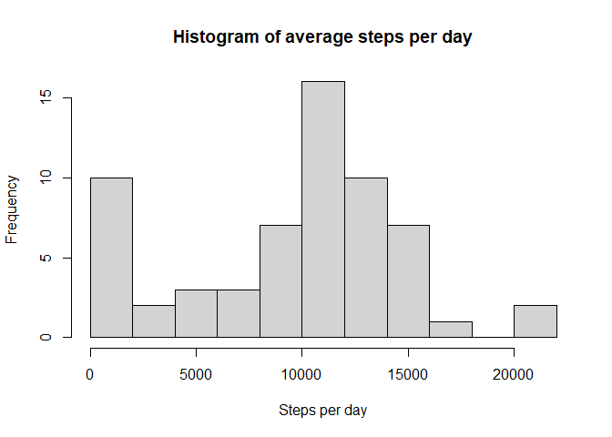
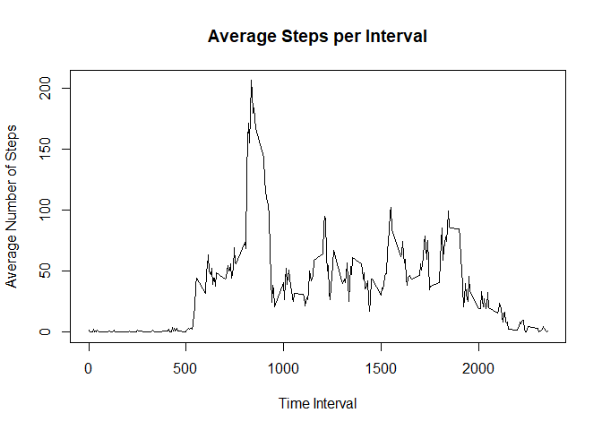
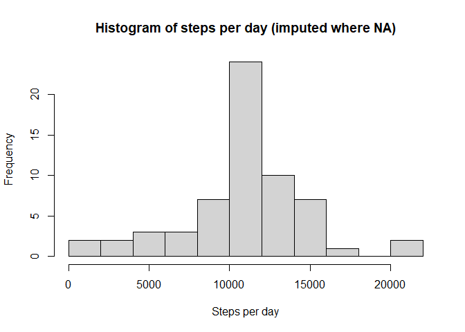
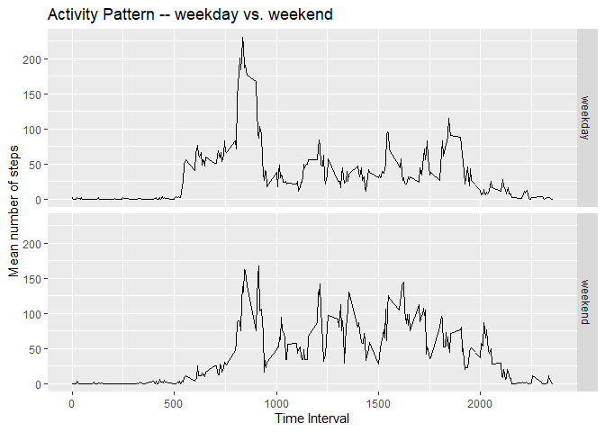

## Setup
Start by setting (echo = TRUE) and declaring libraries to be used

```r
knitr::opts_chunk$set(echo = TRUE, warning = FALSE)  #"always use echo = TRUE" for this assignment, per notes

library(dplyr)
```

```
## 
## Attaching package: 'dplyr'
```

```
## The following objects are masked from 'package:stats':
## 
##     filter, lag
```

```
## The following objects are masked from 'package:base':
## 
##     intersect, setdiff, setequal, union
```

```r
library(ggplot2)
```


## Loading and preprocessing the data
Below we read the .csv tile and transform the date variable to date format

```r
#1:  Load the data
activity <- read.csv("activity.csv")
str(activity)
```

```
## 'data.frame':	17568 obs. of  3 variables:
##  $ steps   : int  NA NA NA NA NA NA NA NA NA NA ...
##  $ date    : chr  "2012-10-01" "2012-10-01" "2012-10-01" "2012-10-01" ...
##  $ interval: int  0 5 10 15 20 25 30 35 40 45 ...
```

```r
#2: Process/Transform the data
activity$date <- as.Date(activity$date)
```


## What is mean total number of steps taken per day?
We start by looking at some high level metrics for each day: mean and median.


```r
#1. Calculate total steps per day
steps_per_day <- activity %>%
 group_by(date) %>%
 summarize(daily_total = sum(steps, na.rm=TRUE))

#2. Make a histogram of the steps taken per day

hist(steps_per_day$daily_total, breaks=10, main="Histogram of average steps per day", xlab="Steps per day")
```

<!-- -->

```r
#3. Calculate and report the mean and median of the total number of steps taken per day

daily_mean <- round(mean(steps_per_day$daily_total, na.rm=TRUE))
daily_median <- median(steps_per_day$daily_total, na.rm=TRUE)
```

**The daily mean is 9354 and the daily median is 10395 steps per day.**

## What is the average daily activity pattern?
 Next, we visually examine the steps per interval, and calculate the maximum step interval.


```r
#1. Make a time series plot of the 5 minute interval (x axis) and the average number of steps taken, averaged across all days (y axis)

#start by summarizing the average steps per interval

interval_summary <- activity %>%
  group_by(interval) %>%
  summarize(ave_steps = mean(steps, na.rm=TRUE))

#the plot

with(interval_summary,
     {plot(interval, ave_steps, type="l", main = "Average Steps per Interval", xlab="Time Interval", ylab = "Average Number of Steps")
       })
```

<!-- -->

```r
#2. Which 5-minute interval, on average across all the days in the dataset, contains the maximum number of steps?

interval_max <- interval_summary[which.max(interval_summary$ave_steps),]
```

**The interval with the maximum average number of steps is 835.**
  
  
## Imputing missing values

A number of values in the dataset are coded as NA.  We will calculate the number of NA's, and then apply a strategy to impute missing values **by using the average value for that interval**.

Finally, we'll compare the new mean and median with the previous.


```r
#1. Calculate and report the total number of missing values in the dataset

sum(is.na(activity$steps))
```

```
## [1] 2304
```

```r
#2. Devise a strategy for filling in all of the missing values in the dataset.

#   Here we apply a simple strategy to fill missing values with the mean value for that interval.

steps_per_interval <- activity %>%
  group_by(interval) %>%
  summarize(interval_mean = round(mean(steps, na.rm=TRUE)))

#3. Create a new dataset that is equal to the original dataset but with the missing data filled in.

activity_w_mean <- merge(activity, steps_per_interval, by="interval")

#fill in NA values

activity_w_mean$steps <- with(activity_w_mean, {
  ifelse(!is.na(steps) , #not an NA
       steps, #keep steps as is
       interval_mean) #update to the mean value

} #end the if clause
) #end the with statement

#4. Make a histogram of the total number of steps taken each day and Calculate and report the mean and median total number of steps taken per day. Do these values differ from the estimates from the first part of the assignment? What is the impact of imputing missing data on the estimates of the total daily number of steps?

steps_per_day_imputed <- activity_w_mean %>%
  group_by(date) %>%
  summarize(daily_total = sum(steps, na.rm=TRUE))

hist(steps_per_day_imputed$daily_total, breaks=10, main="Histogram of steps per day (imputed where NA)", xlab="Steps per day")
```

<!-- -->

```r
daily_mean2 <- format(round(mean(steps_per_day_imputed$daily_total, na.rm=TRUE)), scientific=FALSE)
daily_median2 <- format(median(steps_per_day_imputed$daily_total, na.rm=TRUE), scientific=FALSE)
```

After imputing, the daily mean is 10766 and the daily median is 10762 steps per day.  Prior to imputation, the mean was 9354 and the median was 10395


## Are there differences in activity patterns between weekdays and weekends?

Below, we examine the activity pattern on weekdays vs. weekends.  We start by definition a factor that is "weekend" if the day is a weekend day, but "weekday" otherwise.

Afterwards, we plot the activity pattern on weekdays vs. weekends.


```r
#1. Create a new factor variable in the dataset with two levels – “weekday” and “weekend” indicating whether a given date is a weekday or weekend day.

activity_w_mean$weekend <- with(activity_w_mean, {
  ifelse(weekdays(date) %in% c("Saturday","Sunday") , #define weekend days
         "weekend", #it's a weekend
         "weekday") #it's a weekday
} #end the if clause
) #end the with statement

#2. Make a panel plot containing a time series plot (i.e. \color{red}{\verb|type = "l"|}type = "l") of the 5-minute interval (x-axis) and the average number of steps taken, averaged across all weekday days or weekend days (y-axis).

 

steps_by_daytype <- activity_w_mean %>%
  group_by(weekend, interval) %>%
  summarize(interval_mean = round(mean(steps, na.rm=TRUE)))
```

```
## `summarise()` has grouped output by 'weekend'. You can override using the `.groups` argument.
```

```r
ggplot(steps_by_daytype, aes(interval, interval_mean)) +
ggtitle("Activity Pattern -- weekday vs. weekend") +
ylab("Mean number of steps") +
xlab("Time Interval") +
geom_line() +
facet_grid(rows=vars(weekend))
```

<!-- -->
